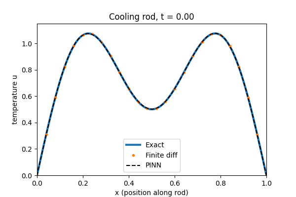
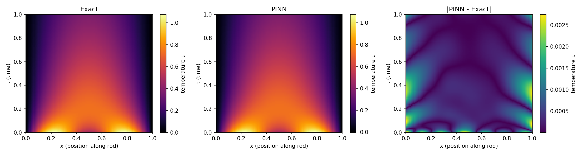
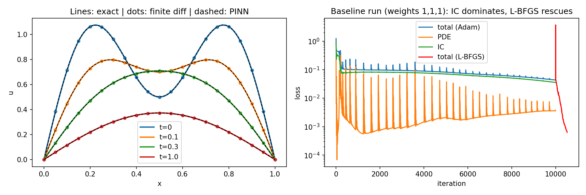

# 1D-Transient-Heat-Conduction
A physics-informed neural network (pure PyTorch) that solves the heat equation on a cooling rod, validated against the exact Fourier solution and a finite-difference solver.

## Problem
u_t = α·u_xx on x ∈ [0,1], t ∈ [0,1], α = 0.1
- IC: u(x,0) = sin(πx) + 0.5·sin(3πx)
- BC: u(0,t) = u(1,t) = 0
- Exact: u = e^(-απ²t)·sin(πx) + 0.5·e^(-9απ²t)·sin(3πx)

## Method
- Network: MLP, 2 inputs (x, t) -> 1 output u, 4 hidden layers x 32 neurons, tanh (3297 params)
- Derivatives u_t, u_xx via `torch.autograd.grad` with `create_graph=True`
- Loss = w_pde·L_pde + w_ic·L_ic + w_bc·L_bc
  - L_pde: mean((u_t/α − u_xx)²) on 5000 random collocation points
  - L_ic: 200 points at t = 0; L_bc: 200 points on each wall
- Training: Adam (10k steps, lr 3e-3, exponential decay) then L-BFGS (500 iters, strong Wolfe)
- Fixed seed (`torch.manual_seed(0)`)

## Results
| Method | Max abs error vs exact | Rel. L2 |
|---|---|---|
| PINN (weights 1,20,20) | 2.75e-3 | 1.27e-3 |
| Finite difference (FTCS, r=0.25) | 7.0e-5 | 4.9e-5 |
| PINN (weights 1,1,1) | 1.67e-2 | n/a |

Weighting the IC and BC terms 20x cut the error about 6x. With equal weights the IC term
plateaued (spectral bias on the sin 3πx mode) and only L-BFGS rescued it.

## Findings
- Loss weighting matters: the optimizer follows the cheapest gradient, so a weak IC term is neglected.
- L-BFGS helps a lot when Adam stalls, but adds little once the residual is limited by the fixed collocation set.
- On this easy forward problem, finite differences beat the PINN in accuracy. PINNs pay off on inverse problems.
- Largest errors sit along the walls (t ≈ 0.1–0.5).

## Run
Open `1D_Transient_Heat_Conduction.ipynb` in Google Colab and run all cells (~4 min on a GPU).

## Possible improvements
Resample collocation points, add more BC points, log the weighted run's loss history.
